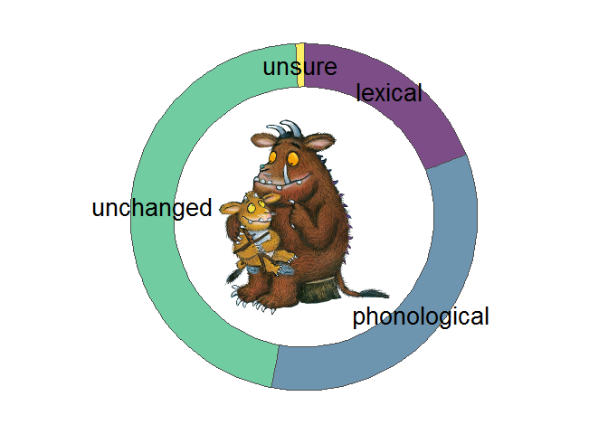
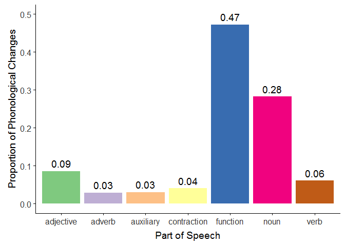
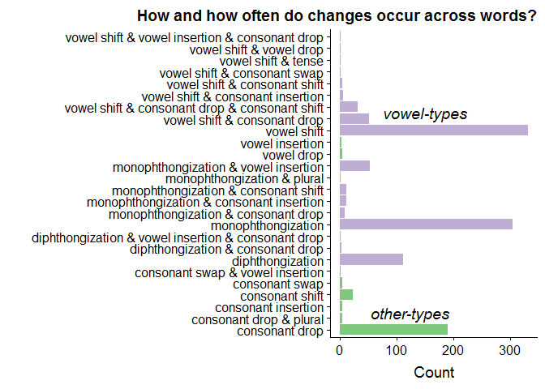
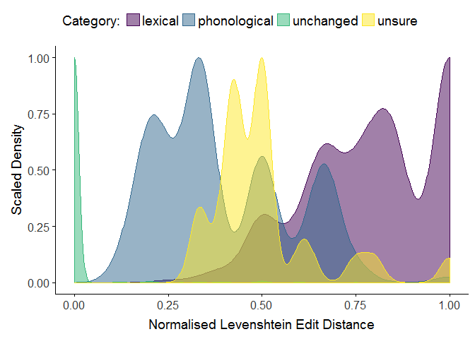
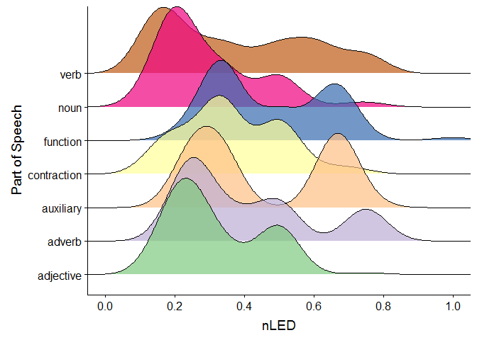
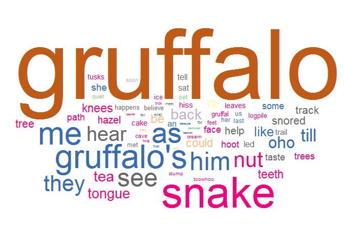
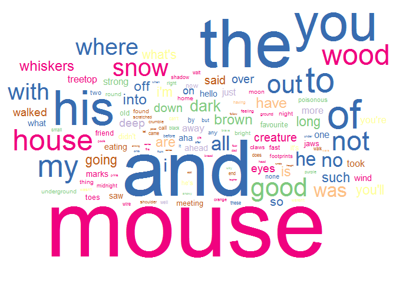
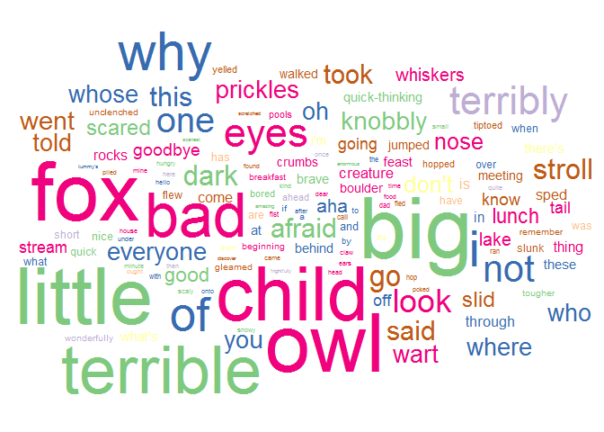

Gruffalo Plots
================

Corpus Analysis: The Gruffalo and The Gruffalo's Child
======================================================

In this post, we'll conduct a corpus analysis for The Gruffalo and The Gruffalo's Child[1] (both by Julia Donaldson), looking at how their Standard British versions vary from their Scots translations (performed by various translators at Itchy-Coo). We'll use the following translations:

**The Gruffalo**

-   The Doric Gruffalo (translated by Sheena Blackhall)
-   Thi Dundee Gruffalo (translated by Matthew Fitt)
-   The Glasgow Gruffalo (translated by Elaine C. Smith)
-   The Gruffalo in Scots (translated by James Robertson)

**The Gruffalo's Child**[2]

-   The Doric Gruffalo's Bairn (translated by Sheena Blackhall)
-   Thi Dundee Gruffalo's Bairn (translated by Matthew Fitt)
-   The Gruffalo's Wean (Scots; translated by James Robertson)

This was prompted by a series of studies I'm running with Vera Kempe and Nikolay Panayotov at Abertay University. In these studies, we're exploring whether exposure to multiple languages/language varieties helps or hinders literacy acquisition using an artificial language learning task. (Spoiler for future posts, it may help!) Before we got started with the study, we had to design a miniature artifical language with multiple varieties (some real examples could be Standard British English and Geordie or differences between many Scots varieties).

We used the Gruffalo books to get an idea for how (and how often) languages can vary, and thus how we should implement this variation in our miniature artificial language. This was a very useful resource for us as, without access to direct corpora, this provides us with a resource for language variation transcribed by experts in the languages and varieties in question.

In this post, we'll explore how the varieties differ across the Gruffalo books. This might be interesting to you if you want to know just how much Scots differs from Standard British English, and how words differ between the two languages.

We'll use R, primarily relying on the `tidyverse` family of functions to perform our analyses. You can skip the code if you just want the results, though, so please read on even if R isn't your thing!

Analysis
========

We'll use a handful of packages for our exploration of the data. The `tidyverse` package is the main workhorse that allows us to do most of our data processing and plotting. Next, we use `cowplot` which allows us to include images in our plots (amongst other cool features), `ggridges` which lets us easily plot some cool ridgeline plots (see the [ggridges GitHub page](https://github.com/clauswilke/ggridges) for a nice example on how to use this pacakge), and `ggwordcloud` for plotting wordclouds for the type frequencies.

``` r
packages <- c(
  "here",
  "tidyverse",
  "cowplot",
  "ggridges",
  "ggwordcloud"
)

# apply library to all names in packages
lapply(packages, library, character.only = TRUE)
```

Prepare the Raw Data
--------------------

### Read the Data into R

First we'll read in the raw data from the processed data folder. We can use the `readr::read_csv()` function for this.

### Understanding the Raw Data

You'll notice that we've read in two different types of data, named **token** and **type**. These are just different ways of understanding changes in words from one book to another. What do they mean?

-   Token Frequency: How often do words change, counting every occurrence of every word. Here, high frequency words are represented many times in the corpus.
-   Type Frequency: How often do words change, counting only unique occurrences of a word. Here, high frequency words are represented just as often as low frequency words.

Let's take a look at our data. Just how are the token and type data organised? First, the token data.

``` r
glimpse(token)
```

    ## Observations: 3,458
    ## Variables: 18
    ## $ book                    <chr> "doric_child", "doric_child", "doric_c...
    ## $ informant               <chr> "doric", "doric", "doric", "doric", "d...
    ## $ text_count              <dbl> 1, 2, 3, 10, 11, 12, 13, 14, 15, 16, 1...
    ## $ running_count           <dbl> 1, 2, 3, 4, 5, 6, 7, 8, 9, 10, 11, 12,...
    ## $ eng                     <chr> "the", "gruffalo", "said", "set", "foo...
    ## $ scots                   <chr> "the", "gruffalo", "quo", "set", "fit"...
    ## $ diff                    <dbl> 0, 0, 1, 0, 1, 0, 0, 0, 1, 1, 1, 1, 1,...
    ## $ lex                     <dbl> 0, 0, 1, 0, 0, 0, 0, 0, 0, 0, 1, 1, 1,...
    ## $ phon                    <dbl> 0, 0, NA, 0, 1, 0, 0, 0, 1, 1, NA, NA,...
    ## $ unsure                  <dbl> 0, 0, 0, 0, 0, 0, 0, 0, 0, 0, 0, 0, 0,...
    ## $ shift_type              <chr> NA, NA, NA, NA, "vowel_shift", NA, NA,...
    ## $ syllable_shift_location <chr> NA, NA, NA, NA, "nucleus", NA, NA, NA,...
    ## $ CLAWS_tag               <chr> "AT0", "NN1", "AJ0", "AJ0", "NN1", "AV...
    ## $ type                    <chr> "FUN", "PROPER", "VERB", "ADJ", "NOUN"...
    ## $ shift_category          <chr> "unchanged", "unchanged", "lexical", "...
    ## $ LED                     <dbl> 0, 0, 4, 0, 2, 0, 0, 0, 1, 2, 3, 2, 3,...
    ## $ max_length              <dbl> 3, 8, 4, 3, 4, 2, 3, 4, 4, 4, 3, 3, 3,...
    ## $ nLED                    <dbl> 0.00, 0.00, 1.00, 0.00, 0.50, 0.00, 0....

As we can see, the token data contains several columns related to the books in question, which informant (translator) translated the books, and counts of where each English word occurred in the book (1 being the first word, 2 the second, etc.). You can see that we have some missing data here. This is because the English and Scots phrases couldn't always be aligned; to fit the story to a rhyme using Scots words, sometimes entire phrases had to be replaced from the English text, so we don't count this in our analysis. Still, we take a running count of how many English words were traslated into Scots. Next to the English and Scots versions of the words, we also have a number of variables measuring different things. We have a binary code for whether the Scots word is different to the English word lexically or phonologically (or if we were unsure and couldn't categorise it as lexical or phonological). These all take 0 if the English and Scots words don't differ on these measures, and 1 if they do.

Next, we have shift type[3], which describes how words changed (if they did). We can see that, e.g. the English "foot" and Scots "fit" differ by changing a vowel. We also have an indication of where in the word these changes occurred (e.g. onset, nucleus, coda). Note that these measures are only tracked for phonological changes. We also have CLAWS tags -- tags from the English words taken from the [CLAWS part-of-speech tagger for English](http://ucrel.lancs.ac.uk/claws/), which gives us fine-grained part of speech categories for the English words. We also have our own, broad categories informed by these tags, under the shift category column. Finally, we have some objective measures of the difference between the English and Scots words. This is the Levenshtein Edit Distance (LED), which is a count of the number of insertions, subtitutions, and deletions needed to transform the English word to the Scots word. Using the maximum word length from the two words (e.g. English "foot" and Scots "fit" = 4), we can figure our the length-normalised LED, nLED, which shows less variability in scores by extreme word lengths.

So, first off, we want to make this data a little more readable by having nicer names for the parts-of-speech under the `type` header. We can use the `dplyr::case_when()` function for this. This is a nice way to change things by conditions when we have many conditions in our data (avoiding many `if()`, `else()`, or `ifelse()` commands).

``` r
token <- token %>%
  mutate(
    type = case_when(
      type == "FUN" ~ "function",
      type == "PROPER" ~ "proper noun",
      type == "VERB" ~ "verb",
      type == "ADJ" ~ "adjective",
      type == "NOUN" ~ "noun",
      type == "ADV" ~ "adverb",
      type == "AUX" ~ "auxiliary",
      type == "CONTR" ~ "contraction"
    ),
    type = as.factor(type) # enforces ordering for colours in plots
  )
```

Token Frequencies
-----------------

Let's explore the token frequencies for the words. Remember, this just takes a measure of how often things changes across all occurrences of words. This means that words that are very common get counted in the data a lot.

### Exploring Changes

#### Proportions of Changes by Category

First off, we'll figure out the proportion of changes in the English words when translated to Scots for four categories: lexical changes, phonological changes, unchanged words, and cases where we see a change, but we couldn't confidently categorise it (unsure).

``` r
donut_data <- token %>% 
  group_by(shift_category) %>% 
  summarise(
    n = length(nLED), 
    total = nrow(.), 
    proportion = length(nLED)/nrow(.)
  )

# add additional columns to get full coordinates for each category
# used for the donut plot
donut_data$ymax = cumsum(donut_data$proportion)
donut_data$ymin = c(0, donut_data$ymax[1:length(donut_data$ymax)-1])
```

We'll now use this summary of the data to make a donut plot. We'll use an anonymous function which figures out the median of two values, and use the `purrr::pmap_dbl` function to apply this to every row (forcing the output to be a `dbl`, or number). We need this as just calculating the median in a normal `mutate()` call will result in only the first 2 values being used. This method gives us get the correct positions for our labels for each category. We then add these labels to the plot using `annotate()`. Finally, we use functions from `cowplot` to add a picture of the Gruffalo and the Gruffalo's child to the plot.

``` r
# here we map an anonymous function to do row-wise computation of medians
# this finds the location of labels for the donut plot
donut_annotations <- tibble(
  labels = c("lexical", "phonological", "unchanged", "unsure"),
  y = pmap_dbl(donut_data, function(ymin, ymax, ...) median(c(ymin, ymax)))
)

donut_plot <- donut_data %>%
ggplot(aes(fill = shift_category, ymax = ymax, ymin = ymin, xmax = 4, xmin = 3)) +
  geom_rect(colour = "grey30") +
  coord_polar(theta = "y") +
  xlim(c(0, 4)) +
  theme_void() +
  annotate(
    "text", 
    x = 3.5, 
    y = donut_annotations$y, 
    label = donut_annotations$labels,
    size = 7.2
  ) +
  theme(
    panel.grid = element_blank(),
    axis.text = element_blank(),
    axis.ticks = element_blank(),
    axis.title = element_blank(),
    legend.position = "none"
    ) +
  scale_fill_viridis_d(option = "viridis", alpha = 0.7)

# add the gruffalo picture to the plot
ggdraw(donut_plot) + 
  draw_image(here("img", "gruffalo_child.png"), scale = 0.45)
```



While the largest category individually is the unchanged one, taken together we still have more differences in words between the Scots and English versions of the books.

When a change occurs, it is most often a phonological change (e.g. "foot" to "fit") rather than a lexical one (e.g. "child" to "bairn"). Luckily, we have few cases where we're unsure about the categories, which just means I'm not as incompetent at coding as you might imagine.

Next, we'll get a summary of these proportions, so we can be sure how often a change occurs without resorting to the plot.

``` r
token_contrastive <- tibble(
  contrastive = donut_data %>% 
    filter(shift_category %in% c("lexical", "phonological")) %>% 
    pull(n) %>% 
    sum(),
  total = donut_data$total %>% unique()
) %>%
  mutate(proportion = contrastive/total)
```

Using this summary, we can just multiply the proportion data by 100 to get percentages of changes. With this method, we see that across all occurrences of words (token frequency), contrastive words (i.e. those with a lexical/phonological variant) occured 53.01% of the time.

We can use the summaries from the donut plot to look at cases when changes occur. We can then further filter this down to only phonological changes to figure out how often a phonological change occurs when a word is changed.

Using the data from the donut plot, it's clear that a phonological change occurs 33.89% of the time across all books. But, out of all changes, a change is phonological (rather than lexical) 63.94% of the time.

#### Phonological Changes by Part of Speech

Here, we'll explore which parts of speech are particularly affected by lexical or phonological changes when a word is translated from English to Scots. We'll rely on `dplyr` here to filter the words to phonological changes only, before calculating summaries by part of speech.

``` r
token_phon_descriptives <- token %>% 
  filter(phon == 1) %>%
  drop_na() %>%
  group_by(type) %>%
  summarise(
    n = length(nLED), 
    total = nrow(.), 
    prop = length(nLED)/nrow(.)
  )

ggplot(token_phon_descriptives, aes(x = type, y = prop, fill = type)) + 
  geom_bar(stat = "identity")+
  labs(x = "Part of Speech") +
  labs(y = "Proportion of Phonological Changes") +
  theme(
    title = element_text(colour="black", size = 20),
    axis.text.x = element_text(colour="grey20", size = 12),
    axis.text.y = element_text(colour="grey20", size = 12),  
    axis.title.x = element_text(colour="black", size = 14),
    axis.title.y = element_text(colour="black", size = 14),
    legend.position = "none"
  ) +
  geom_text(aes(label = round(prop, 2)), vjust = -0.5, size = 5) +
  coord_cartesian(ylim = c(0, 0.5)) +
  scale_fill_brewer(palette = "Accent")
```



Here we can see that phonogical changes affect function words (47.26%) and nouns (28.21%) of the time. Both of these parts of speech thus involve changes more often than any other part of speech.

#### How do Phonological Changes Occur?

Next up, we'll look at how phonological changes occur when they occur. That is, do the changes when translating a word from English to Scots typically involve changes to the vowels or some other type of change? We'll be quite granular here, focusing on changes like [monophthongization](https://en.wikipedia.org/wiki/Monophthongization) (e.g. English "house" to Scots "hoose") and consonant drops (e.g. English "and" to Scots "an").

To do this in R, we make use of the brilliant functions for working with strings provided by `stringr` (prefixed by `str_`). We use this in combination with `dplyr::case_when()` to clean up our names for plotting (e.g. removing underscores and plus signs) by first detecting all strings with an underscore and + in the `shift_type` column, before replacing these characters with a space and &. We finally make a broad category for plotting to make it a little easier to see when changes involve a vowel or not.

``` r
# must escape special characters when working with strings
replacements <- c(
  "\\_" = " ",
  "\\+" = " \\& "
)

token_shift_type <- token %>% 
  filter(phon == 1) %>%
  drop_na() %>%
  group_by(shift_type) %>%
  summarise(n = n()) %>%
  arrange(desc(n)) %>%
  mutate(
    shift_type = case_when(
    str_detect(shift_type, "\\_|\\+") ~ 
      str_replace_all(shift_type, replacements),
    TRUE ~ shift_type
    )
  ) %>% 
  # used for plotting differences in broad categories
  mutate(
    category = case_when(
      str_detect(
        shift_type, 
        "vowel shift|monophthongization|diphthongization"
      ) ~ "vowel_shift",
      TRUE ~ "other"
    )
  )
```

We can then plot this data with flipped axes for easier viewing like so.

``` r
token_shift_type %>%
  ggplot(aes(x = shift_type, y = n, fill = category)) +
  geom_bar(stat = "identity") +
  coord_flip() +
  labs(
    title = "How and how often do changes occur across words?",
    x = "",
    y = "Count"
  ) +
  theme(
    plot.title = element_text(hjust = 1),
    legend.position = "none"
  ) +
  scale_fill_brewer(palette = "Accent") +
  annotate(
    "text", 
    x = 19.5, 
    y = 150, 
    label = "vowel-types", 
    size = 5, 
    fontface = "italic"
  ) +
  annotate(
    "text", 
    x = 2.5, 
    y = 125, 
    label = "other-types", 
    size = 5, 
    fontface = "italic"
  )
```



We can see from this plot that most changes involve a vowel. But, there's a lot of variability here, with many cases involving changes to both vowels and consonants. Let's reduce this down to two simple categories: how often is a phoneme substituted with something else, and how often is a consonant dropped entirely from the word?

``` r
c_drops <- token_shift_type %>% 
  filter(str_detect(shift_type, "consonant drop")) %>%
  summarise(n = sum(n)) %>%
  as.numeric()

subs <- token_shift_type %>% 
  filter(str_detect(
    shift_type, 
    "vowel shift|monophthongization|diphthongization"
  )) %>%
  summarise(n = sum(n)) %>%
  as.numeric()

token_shift_summary <- tibble(
  c_drops = c_drops,
  subs = subs
)
```

Using these summaries (which are just numbers, so I won't provide a table), we found that approximately 0.24% of all phonological changes involve dropping a consonant from the word, while 0.76% involve substution of a vowel.

### Exploring nLEDs

#### Densities by Category

How good was our categorisation into phonological or lexical changes?

``` r
legend_title <- "Category: "

token %>%
  ggplot() +
  geom_density(
    aes(
      x = nLED, 
      group = shift_category, 
      colour = shift_category, 
      fill = shift_category,
      y= ..scaled..
    ), 
    alpha = 0.5
  ) +
  theme(
    title = element_text(colour = "black", size = 20),
    axis.text.x = element_text(colour = "grey20", size = 12),
    axis.text.y = element_text(colour = "grey20", size = 12),  
    axis.title.x = element_text(colour = "black", size = 14),
    axis.title.y = element_text(colour = "black", size = 14),
    legend.title = element_text(size = 14),
    legend.text = element_text(size = 14),
    legend.position = "top",
    legend.background = element_rect(colour = "black"),
    legend.spacing.x = unit(0.1, "cm")
    ) +
  labs(
    x = "Normalised Levenshtein Edit Distance",
    y = "Scaled Density",
    fill = legend_title,
    colour = legend_title
  ) +
  scale_colour_viridis_d(option = "viridis", aesthetics = c("colour", "fill"))
```



By and large, the nLEDs for words with a phonological change are (unsurprisingly) unlike those that are unchanged, but they are also distinctly different those categorised as a lexical change. Nicely, we can see that when we were unsure if a word involved a phonological or lexical change, the nLEDs for these words fell between the distributions of those in the phonological and lexical categories. That's quite reassuring!

#### Densities by Part of Speech

Finally, for these token frequencies, let's take a look at the nLEDs split by part of speech. Are different parts of speech affected by major (associated with high nLEDs) or minor (associated with low nLEDs) changes when translating from English to Scots?

``` r
token %>%
  drop_na() %>%
  ggplot(aes(x = nLED, y = type, fill = type)) +
  geom_density_ridges(scale = 3, alpha = 0.7, bandwidth = 0.0606) +
  coord_cartesian(xlim = c(0, 1)) +
  scale_x_continuous(breaks = seq(0, 1, 0.2)) +
  labs(x = "nLED", y = "Part of Speech") +
  scale_fill_brewer(palette = "Accent") +
  theme(legend.position = "none")
```



Largely, across all parts of speech, any changes are minimial. This indicates that no change or minor changes to phonology are most common across most parts of speech. We can also see some bimodal distributions and fat tails for distributions for certain categories.

What's going on for nouns? Since this analysis includes many words (and all occurrences of them), it's likely that certain nouns rarely change (e.g. "time"), while others change very often (e.g. English "mouse" and Scots "moose"). This pattern might be masked by how frequently certain words occur. So, to get a better picture of how words change as a whole (without influences from word frequency), we might want to focus more on a **type frequency** analysis.

Type Frequencies
----------------

We'll conduct a brief exploration into the type frequencies of words. This takes all unique words from the book in English, and looks at how often they change, and how they change. This just involves some simple counting.

First, lets get an idea of how the data are laid out.

``` r
head(type)
```

    ## # A tibble: 6 x 7
    ##   eng    count total_diff  none   lex  phon unsure
    ##   <chr>  <dbl>      <dbl> <dbl> <dbl> <dbl>  <dbl>
    ## 1 a        151          1   150     1     0      0
    ## 2 afraid     8          8     0     8     0      0
    ## 3 after      2          2     0     1     1      0
    ## 4 aha       12          8     4     4     4      0
    ## 5 ahead     10          7     3     2     5      0
    ## 6 all       13         13     0     0    13      0

Here you can see that we have each unique word in Standard British English, followed by a count of how often this word occurs, and many columns indicating counts for the number of overall changes to the word (total\_diff), how often no change occurs, and finally how often lexical, phonological, or unsure changes occur (essentially splitting up the total\_diff column).

We'll focus here on how often words change by category, making some plots to show how this varies by part of speech.

### Exploring Changes

First, lets see how often phonological and changes occur across all words. This just looks at words with at least one occurrence of a phonological or lexical change across all books and informants.

``` r
type_shifts <- type %>%
  summarise(
    n = n(),
    phon = sum(phon != 0),
    lex = sum(lex != 0)
  )
```

Phonological changes occur 46.13% of the time across all books, while lexical changes occur 47.1% of the time. When a change occurs, this change is phonological (rather than lexical) 49.48% of the time.

How does this map onto the different parts of speech that we explored above for the token frequency data? We can look at both phonological and lexical changes in more detail using some wordcloud plots.

To do this, we'll get only the unique occurrences of English words (and their associated part of speech, termed `type`). We'll then perform a join (using `dplyr::left_join()`) on the type frequency data and these categories. This will add the parts of speech to the type data, joining by English word.

``` r
word_pos <- distinct(token, eng, type)

type_pos <- left_join(type, word_pos, by = "eng") %>%
  drop_na(type) %>%
  mutate(type = as.factor(type)) # enforces ordering for colours in plots
```

We can then do some operations on this data to see which words change (and how often), and which words never change.

``` r
changing_types <- type_pos %>% filter(total_diff != 0)
unchanging_types <- type_pos %>% filter(total_diff == 0)
```

Finally, we can use this data to further filter by cases with phonological changes and cases with lexical changes.

We'll make some word cloud plots out of the type frequencies. This will show us all of the words from the corpus, with larger words occurring most often. We then colour the words according to their parts of speech (labelled in previous plots).

First off, let's look a words that never have a phonological change from English to Scots.

``` r
ggplot(unchanging_types, aes(label = eng, size = count, colour = type)) +
  geom_text_wordcloud_area() +
  scale_size_area(max_size = 50) +
  scale_colour_brewer(palette = "Accent")
```



We can see that the biggest offender for not changing is the Gruffalo itself! That's not surprising, given that this is a proper noun. We can also see that other (non-proper) nouns often don't change, along with a good number of function words.

#### Phonological Changes

How about words that involve at least one phonological change?

``` r
ggplot(
  changing_types %>% filter(phon != 0), 
  aes(label = eng, size = phon, colour = type)
) +
  geom_text_wordcloud_area() +
  scale_size_area(max_size = 42) +
  scale_colour_brewer(palette = "Accent")
```



Function words change most often in this case, but we also have a large number of function words (e.g. English "the" and Dundonian "thi") and verbs in there too. Nicely, mouse (Scots "moose") is represented a lot. This isn't surprising given that the mouse is a major character in the stories. We also have some other good examples in house ("hoose") and wood ("wid") which occur quite frequently in the stories.

So, what about lexical changes? We'll use the same process as before, but this time we'll filter only to words with at least one lexical change.

#### Lexical Changes

``` r
ggplot(
  changing_types %>% filter(lex != 0), 
  aes(label = eng, size = lex, colour = type)
) +
  geom_text_wordcloud_area() +
  scale_size_area(max_size = 25) +
  scale_colour_brewer(palette = "Accent")
```



Nicely, we see a slightly different pattern here when compared to the phonological changes. What sticks out in this case is the large number of adjectives that change. For example, we have the Standard British English "big" which changes to the Doric, Dundonian, and Scots "muckle". As with the phonological changes, we have a good number of nouns that change. We can see fox, child, and owl change very often (amongst others). Or should that be the tod, bairn, and hoolet?

Closing Remarks
===============

Taking all of these findings into consideration, you can see that Scots is a rich and diverse language. Even from such a simple exploration like this, it's apparent that Scots is very distinct to Standard British English. Hopefully, with books such as the Gruffalo and the Gruffalo's Child being translated into Scots, we can engage people with Scots and Scots literature, preserving such a distinct and interesting language for future generations. Writing this was affy fun, so thanks for sticking with it!

[1] Use of the images and text of The Gruffalo and The Gruffalo's Child for communication and research purposes has been approved by Macmillan publishers.

[2] The Gruffalo's Child was not available in Glaswegian when we started the corpus analysis.

[3] We use shift in the code as this is how changes were initially defined in the data set. Throughout the text, we will just use change to avoid confusion.
